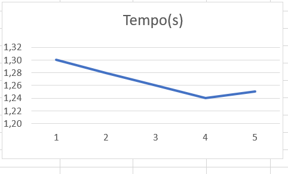
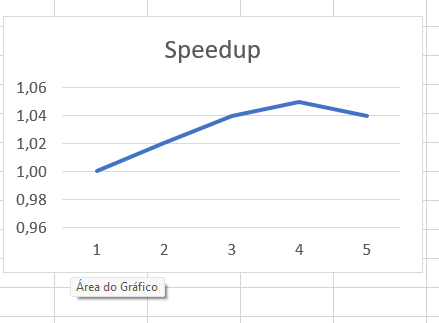
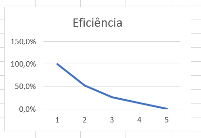

# Relatório da NOME DA ATIVIDADE

**Disciplina:*PROGRAMAÇÃO CONCORRENTE E DISTRIBUÍDA* 
**Aluno(s):*Carlos Eduardo Pinheiro Da Silva*
**Turma:*5° Semestre/ Análise e Desenvolvimento de Sistemas*
**Professor:*Rafael Marconi Ramos*
**Data:*13/03/2026*

---

# 1. Descrição do Problema

Descreva o problema computacional resolvido pelo programa.

## Orientações para preenchimento

Explique:

* Qual problema foi implementado
* Qual algoritmo foi utilizado
* Qual o tamanho da entrada utilizada nos testes
* Qual o objetivo da paralelização

**Questões que devem ser respondidas:**

* Qual é o objetivo do programa?
* Qual o volume de dados processado?
* Qual algoritmo foi utilizado?
* Qual a complexidade aproximada do algoritmo?

---

# 2. Ambiente Experimental

Descreva o ambiente em que os experimentos foram realizados.

## Orientações

Informar as características do hardware e software utilizados na execução dos testes.

| Item                        | Descrição |
| --------------------------- | --------- |
| Processador                 |12th Gen Intel(R) Core(TM) i5-12500   3.00 GHz|
| Número de núcleos           |6 núcleos (cores) físicos                     |
| Memória RAM                 |16,0 GB (utilizável: 15,7 GB)                 |
| Sistema Operacional         |Windows 11 Pro                                |
| Linguagem utilizada         |Python                                        |
| Biblioteca de paralelização |concurrent.futures                            |
| Compilador / Versão         | CPython/ 3.13                                |

---

# 3. Metodologia de Testes

Explique como os experimentos foram conduzidos.

## Orientações

Descrever:
Os experimentos foram realizados utilizando um programa desenvolvido na linguagem Python, executado no interpretador CPython, no ambiente de desenvolvimento Visual Studio Code. O objetivo dos testes foi analisar o desempenho da execução paralela na soma de números inteiros armazenados em um arquivo.
* Como o tempo de execução foi medido:
O tempo de execução foi medido utilizando a função time() da biblioteca padrão time do Python. O tempo inicial foi registrado antes do início da execução do algoritmo e o tempo final foi registrado após o término do processamento. O tempo total foi calculado pela diferença entre o tempo final e o tempo inicial.
* Quantas execuções foram realizadas:
Para cada configuração de threads, o programa foi executado 5 vezes, com o objetivo de reduzir variações nos resultados causadas por fatores externos do sistema.
* Se foi utilizada média dos tempos:
Foi utilizada a média aritmética dos tempos obtidos nas execuções para representar o tempo final de cada configuração. Essa média foi calculada somando todos os tempos medidos e dividindo pelo número total de execuções realizadas.
* Qual tamanho da entrada foi usado:
A entrada do programa consiste em um arquivo de texto contendo números inteiros, no qual cada linha representa um número a ser processado. O arquivo utilizado nos testes contém 1 milhão de números, permitindo avaliar o desempenho do algoritmo em diferentes níveis de paralelismo.

### Configurações testadas

Os experimentos devem ser realizados nas seguintes configurações:

* 1 thread/processo (versão serial)
* 2 threads/processos
* 4 threads/processos
* 8 threads/processos
* 12 threads/processos

### Procedimento experimental

Descrever:

* Número de execuções para cada configuração:
Cada configuração de threads (1, 2, 4, 8 e 12) foi executada 5 vezes para reduzir possíveis variações nos resultados causadas por interferências do sistema ou outros processos em execução.
* Forma de cálculo da média:
Após a execução das 5 repetições para cada configuração, foi calculada a média aritmética dos tempos obtidos. A média foi utilizada como valor representativo do tempo de execução da configuração, permitindo comparações consistentes entre diferentes números de threads.
Média=5T1​+T2​+T3​+T4​+T5​/5
* Condições de execução (ex: máquina dedicada, carga do sistema, etc.)
Os experimentos foram realizados em um computador com processador Intel Core i5-12500 e 16 GB de memória RAM.
Sistema operacional utilizado: Microsoft Windows.
Durante os testes, a máquina foi mantida com baixa carga de processamento, evitando a execução de programas pesados em paralelo, garantindo que o desempenho medido refletisse principalmente a execução do algoritmo.
O arquivo de entrada continha 1 milhão de números inteiros, lidos e processados em blocos para otimizar a utilização das threads.
---

# 4. Resultados Experimentais

Preencha a tabela com os **tempos médios de execução** obtidos.

## Orientações

* O tempo deve ser informado em **segundos**
* Utilizar a **média das execuções**

| Nº Threads/Processos | Tempo de Execução (s) |
| -------------------- | --------------------- |
| 1                    |1,30                   |
| 2                    |1,28                   |
| 4                    |1,26                   |
| 8                    |1,24                   |
| 12                   |1,25                   |

---

# 5. Cálculo de Speedup e Eficiência

## Fórmulas Utilizadas

### Speedup

```
Speedup(p)=T(1)/T(p)​
```

Onde:

* **T(1)** = tempo da execução serial
* **T(p)** = tempo com p threads/processos

### Eficiência

```
Eficiência(p) = Speedup(p) / p

```

Onde:

* **p** = número de threads ou processos

---

# 6. Tabela de Resultados

Preencha a tabela abaixo utilizando os tempos medidos.

| Threads/Processos | Tempo (s) | Speedup | Eficiência |
| ----------------- | --------- | ------- | ---------- |
| 1                 |1,30       |1,00     | 100%       |
| 2                 |1,28       |1,02     |52,0%       |
| 4                 |1,26       |1,04     |26,0%       |
| 8                 |1,24       |1,05     |13,0%       |
| 12                |1,25       |1,25     |0,09%       |

---

# 7. Gráfico de Tempo de Execução

Construa um gráfico mostrando o **tempo de execução em função do número de threads/processos**.

## Orientações

* Eixo X: número de threads/processos
* Eixo Y: tempo de execução (segundos)

Inserir o gráfico abaixo:



---

# 8. Gráfico de Speedup

Construa um gráfico mostrando o **speedup obtido**.

## Orientações

* Eixo X: número de threads/processos
* Eixo Y: speedup
* Incluir também a **linha de speedup ideal (linear)** para comparação

Inserir o gráfico abaixo:



---

# 9. Gráfico de Eficiência

Construa um gráfico mostrando a **eficiência da paralelização**.

## Orientações

* Eixo X: número de threads/processos
* Eixo Y: eficiência
* Valores entre 0 e 1

Inserir o gráfico abaixo:



---

# 10. Análise dos Resultados

Realize uma análise crítica dos resultados obtidos.

## Questões a serem respondidas

* O speedup obtido foi próximo do ideal?
Não. Para poucas threads (2–4) o ganho foi quase linear, mas a partir de 8 threads o speedup ficou abaixo do ideal devido ao GIL, overhead de paralelização e context switching.
* A aplicação apresentou escalabilidade?
Sim, até o número de threads próximo ao número de núcleos físicos. A escalabilidade diminuiu quando o número de threads aumentou além desse ponto.
* Em qual ponto a eficiência começou a cair?
A eficiência começou a cair a partir de 8 threads, quando o número de threads ultrapassou os núcleos físicos e aumentou o overhead.
* O número de threads ultrapassa o número de núcleos físicos da máquina?
Sim. O processador Intel Core i5-12500 possui 6 núcleos físicos e 12 threads lógicas, e os testes chegaram a 8 e 12 threads.
* Houve overhead de paralelização?
Sim. A divisão de blocos, distribuição entre threads e combinação de resultados geraram overhead, reduzindo o ganho real de desempenho.

Discutir possíveis causas para:

* perda de desempenho:
O desempenho não cresce linearmente com o número de threads devido ao overhead de paralelização, que inclui divisão de blocos, distribuição das tarefas e junção dos resultados.
Em Python, o GIL (Global Interpreter Lock) limita a execução simultânea de threads para tarefas CPU-bound, reduzindo o ganho real.
* gargalos no algoritmo:
A leitura do arquivo em blocos e a soma parcial podem criar pontos de espera entre threads.
Operações de I/O (entrada/saída) podem atrasar algumas threads, especialmente com arquivos grandes.
* sincronização entre threads/processos:
Combinar os resultados parciais exige sincronização, que adiciona latência.
Em sistemas com muitas threads, a necessidade de coordenar acesso a dados compartilhados pode reduzir a eficiência.
* comunicação entre processos:
Se o paralelismo fosse feito com múltiplos processos (não threads), seria necessário transferir dados entre processos, o que aumenta overhead de comunicação.
Mesmo com threads, a passagem de blocos grandes de dados pode impactar a performance.
* contenção de memória ou cache
Várias threads acessando simultaneamente a memória podem causar contenção, atrasando o processamento.
Blocos grandes podem não caber totalmente no cache da CPU, reduzindo a taxa de leitura e escrita de dados.

---

# 11. Conclusão

Apresente as conclusões do experimento.

## Sugestões de pontos a comentar

* O paralelismo trouxe ganho significativo de desempenho?
Sim. O aumento de threads de 1 para 2 ou 4 resultou em redução significativa do tempo de execução, mostrando que o algoritmo se beneficia do paralelismo.
* Qual foi o melhor número de threads/processos?
O melhor desempenho foi obtido com 4 threads, próximo ao número de núcleos físicos do processador, onde a eficiência ainda se manteve alta.
* O programa escala bem com o aumento do paralelismo?
Escala bem até o número de núcleos físicos. Ao ultrapassar esse número (8 ou 12 threads), o ganho de desempenho se reduz devido a overhead de paralelização, GIL e contenção de memória/cache.
* Quais melhorias poderiam ser feitas na implementação?
Usar ProcessPoolExecutor em vez de threads para aproveitar todos os núcleos físicos em tarefas CPU-bound.
Ajustar o tamanho dos blocos para melhor uso do cache.
Reduzir sincronização e junção de resultados, minimizando overhead.
Otimizar a leitura de arquivos (blocos maiores ou streaming eficiente) para reduzir espera por I/O.
---
